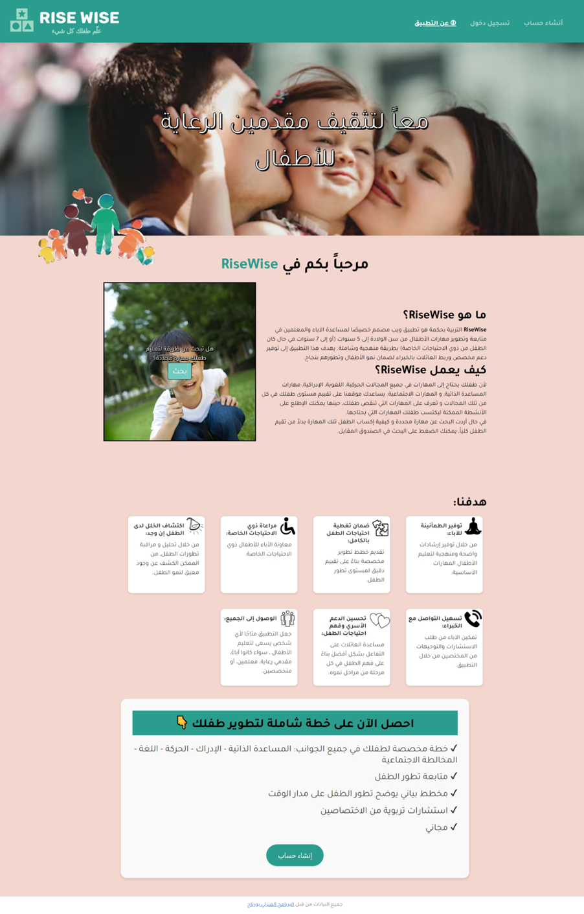

# RiseWise
#### Video Demo:  <https://www.youtube.com/watch?v=dIjMtugDess&t=1s>
#### Description: RiseWise is a platform designed to assist parents in tracking and supporting their child’s developmental milestones, offering personalized activities, and enabling seamless communication with specialists.
## Technologies Used:
- Backend: [Flask](https://flask.palletsprojects.com/en/1.1.x/)
- Data visualization: [Chart.js](https://www.chartjs.org/)
- Python
- Frontend: HTML,CSS, Javascript
- Database: SQLite
- Encryption: cryptography.fernet 

## How Code Works:
- User Registration: Parents and specialists create accounts with secure login credentials.
- Child Evaluation: Parents assess their child's performance on tasks categorized by age ranges.
- Activity Recommendations: The system suggests activities based on evaluation results.
- Tracking Progress: Parents can view dynamic charts and reports that highlight their child's growth.
- Expert Consultation: Chat with specialists to receive tailored advice and recommendations.
## explaning each page in the project:
### HomePage:
- Overview of the child’s current progress.
- Options to start a new evaluation, view reports, or contact specialists.
- Parents record their child's ability to perform tasks (Can Do, Learning, Cannot Do).
- Suggested activities are provided for tasks marked as "Learning" or "Cannot Do."
<p></p>
<p></p>

### Progress Page:
- Visual charts showcasing progress in various developmental areas.
- Downloadable reports for offline review or specialist sharing.
<p></p>

### Chat Page:
- Real-time messaging with specialists for guidance and support.
- A user-friendly interface with past conversation history.
<p></p>

### Settings Page:
- Update user and child profile details.
- Upload a circular image of the child. 
<p></p>

### About Page:
- Detailed explanation of the platform’s purpose and benefits.
<p></p>

## Getting Started:
### Installation
1. **Clone the repository**:
    ```bash
    git clone https://github.com/Noor2003-hub/RW.git
    cd RW
    ```

2. **Install dependencies**:
    ```bash
    pip install -r requirements.txt
    ```

3. **Set up the database**:
    ```bash
    flask db upgrade
    ```

4. **Run the application**:
    ```bash
    flask run
    ```
### Usage
- Register as a parent or specialist.
- Evaluate the child’s performance and view progress reports.
- Use the chat feature to connect with specialists for advice.

## License
All data provided by Poratge.
